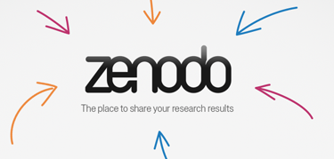

```{r setup, include=FALSE, message=FALSE}
options(htmltools.dir.version = FALSE)
library(knitrBootstrap)
library(anicon)
library(icon)
library(kableExtra)
library(DiagrammeR)
```

class: title-slide, animated, fadeIn

# Formation Open Science - Retour d'expérience
### Sébastien GUYADER
#### INRA - UR Astro - Petit-Bourg - _sebastien.guyader@inra.fr_
<br><br><br>
.right[]

---

layout: true
class: main-slide, animated, fadeIn
<div class="my-footer"><span>S. Guyader &nbsp; - &nbsp; Formation Open Science - Retour d'expérience</span></div> 

---

## Contexte

### Historique
.Large[
- intérêt de longue date pour le **libre**, **open source**
- idée de partage, de participation, et pollinisation croisée des idées...
- partager les fruits de la recherche semble naturel
- plus concrètement : passage au système d'exploitation Linux, aux logiciels FOSS :
<br><br>
 &nbsp;&nbsp;&nbsp;&nbsp;&nbsp;&nbsp;

&nbsp;&nbsp;&nbsp;&nbsp;&nbsp;&nbsp;

&nbsp;&nbsp;&nbsp;&nbsp;&nbsp;&nbsp;
**...**
]

---

## Contexte

### Mise en pratique
.Large[
- participation à un MOOC "Recherche Reproductible : principes méthodologiques pour une science transparente" :
  * **Markdown** pour la prise de notes structurées
  * Outils d'indexation
  * Entrepôts "**Git**" pour le suivi de version et le travail collaboratif
  * Notebooks (Jupyter, **RStudio** ou **Org-Mode**) : documents computationnels
]
--
.Large[
- test de dépôt de données :
  * dataset "test" contenant : 2 fichiers texte (données de 2 expés), 1 fichier comptuationel (Rmd), 1 fichier PDF
  * essais avec 2 plateformes : **data.inra.fr** (INRA) et **zenodo** (CERN)
  * verdict sur data.inra.fr :
    - **positif** : entrepôt "maison" (communauté)
    - **négatif** : manque de souplesse (autorisations, timeout), lenteur d'affichage, infos dispatchées sur différentes pages, serveur parfois injoignable
]

---

## Benchmarking
<br>


.pull-left[
[](https://data-preproduction.inra.fr/dataset.xhtml?persistentId=doi:10.70112/HZLEYQ)
]

.pull-right[
[](https://sandbox.zenodo.org/record/421328)
]
