```{r setup, include=FALSE, message=FALSE}
options(htmltools.dir.version = FALSE)
library(knitrBootstrap)
library(anicon)
library(icon)
library(kableExtra)
library(DiagrammeR)
```

class: title-slide, animated, fadeIn

# Maladies cryptogamiques : méthodes de lutte
### 27 janvier 2020 / Master 1 Biologie Santé 
#### Sébastien GUYADER - INRAE - UR Astro - Petit-Bourg - _sebastien.guyader@inrae.fr_
<br><br><br><br><br><br>
.right[]

---

layout: true
class: main-slide, animated, fadeIn
<div class="my-footer">
Maladies cryptogamiques : méthodes de lutte
<span>27 janvier 2020 / Master 1 Biologie Santé / Sébastien Guyader</span></div> 

---
name: plan

.left-column[
# Plan
]

.right-column[
<br>
### **1. Introduction sur les maladies cryptogamiques**
  1.1. Repères historiques<br>
  1.2. Le "triangle de la maladie"<br>
  {{content}}
]
--
### **2. Biologie et épidémiologie des champignons phytopathogènes**
  2.1. Caractéristiques générales<br>
  2.2. Eléments d'épidémiologie<br>
{{content}}
--
### **3. Méthodes de lutte**
  3.1. Chimique<br>
  3.2. Génétique<br>
  3.3. Biologique<br>
  3.4. Prophylactique<br>
  3.5. Intégrée<br>
{{content}}
<br>
---

layout: false
class: main-slide, middle, animated, fadeIn
<div class="my-footer">
Maladies cryptogamiques : méthodes de lutte
<span>27 janvier 2020 / Master 1 Biologie Santé / Sébastien Guyader</span></div> 

# 1. Introduction

---

layout: true
class: main-slide, animated, fadeIn
<div class="my-footer">
Maladies cryptogamiques : méthodes de lutte
<span>27 janvier 2020 / Master 1 Biologie Santé / Sébastien Guyader</span></div> 

---

## 1.1. Repères historiques

### L'ergot des céréales

.pull-left[
.large[
- Maladie de l'**ergotisme** : symptômes neurologiques (convulsions), physiques (gangrènes)
- Connue depuis **plus de 2000 ans**, mais épidémies importantes au Moyen Age
<br><br>
```{r echo=F, out.width="40%"}
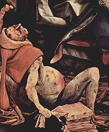
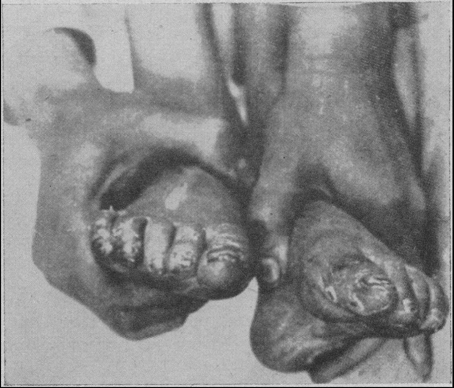
```
]
]
--
.pull-right[
.large[
- Cause : l'ergot du seigle *Claviceps purpurea*
- ingestion de farine contaminée par des ergots (sclérotes) entraîne une **intoxication par alcaloïdes**
- la caractérisation de ces alcaloïdes a conduit à la découverte du **LSD**
<br><br>
```{r echo=F, out.width="100%"}
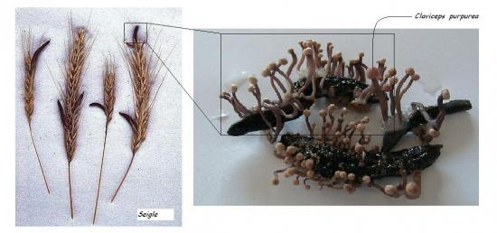
```
]
]

---

## 1.1. Repères historiques

### La grande famine en Irlande

.pull-left[
.large[
- Au XIX<sup>e</sup> siècle, **effondrement de la production** de pomme de terre (1845-1852)
- **1 million de morts** + 1 million d'émigrés vers les USA (chute de plus de 20% de la population)
<br><br>
```{r echo=F, out.width="45%"}
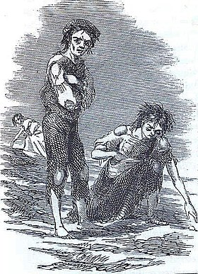
```
]]
--
.pull-right[
.large[
- Cause : le **mildiou de la pomme de terre** *Phytophtora infestans*
- La maladie entraîne une **nécrose** des feuilles et des tubercules
<br><br>
```{r echo=F, out.width="55%"}
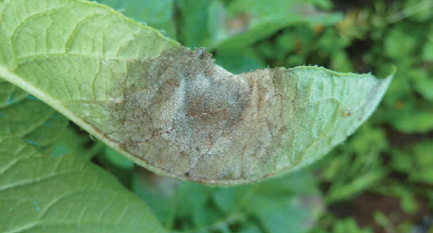
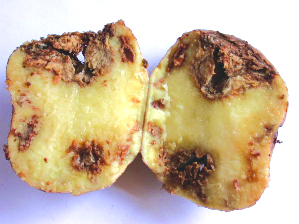
```
]]

---

## 1.2. Le "triangle de la maladie"

### Maladie = interaction entre 3 éléments fondamentaux

.indent[.indent[.indent[.indent[.indent[.indent[
```{r, echo=FALSE, out.width="70%"}
DiagrammeR::grViz("triangle.dot")

```
]]]]]]

---

## 1.2. Le "triangle de la maladie"

### Maladie = interaction entre 3 éléments fondamentaux

.indent[.indent[.indent[.indent[.indent[.indent[
```{r, echo=FALSE, out.width="70%"}
DiagrammeR::grViz("tetraedre.dot")

```
]]]]]]

---

layout: false
class: main-slide, middle, animated, fadeIn
<div class="my-footer">
Maladies cryptogamiques : méthodes de lutte
<span>27 janvier 2020 / Master 1 Biologie Santé / Sébastien Guyader</span></div> 

# 2. Biologie et épidémiologie des champignons phytopathogènes

---

layout: true
class: main-slide, animated, fadeIn
<div class="my-footer">
Maladies cryptogamiques : méthodes de lutte
<span>27 janvier 2020 / Master 1 Biologie Santé / Sébastien Guyader</span></div> 

---

## 2.1. Caractéristiques générales

<br>
.pull-left[
- .Large[Groupe très hétérogène]<br><br>
- .Large[Plus de 100 000 espèces recensées]<br><br>
- .Large[Responsables de 60% des maladies des plantes]<br><br>
- .Large[Organismes hétérotrophes (par absorption)]<br><br>
- .Large[Grand potentiel d'adaptation aux milieux]
]
.pull-right[
```{r echo=F, out.width="70%"}
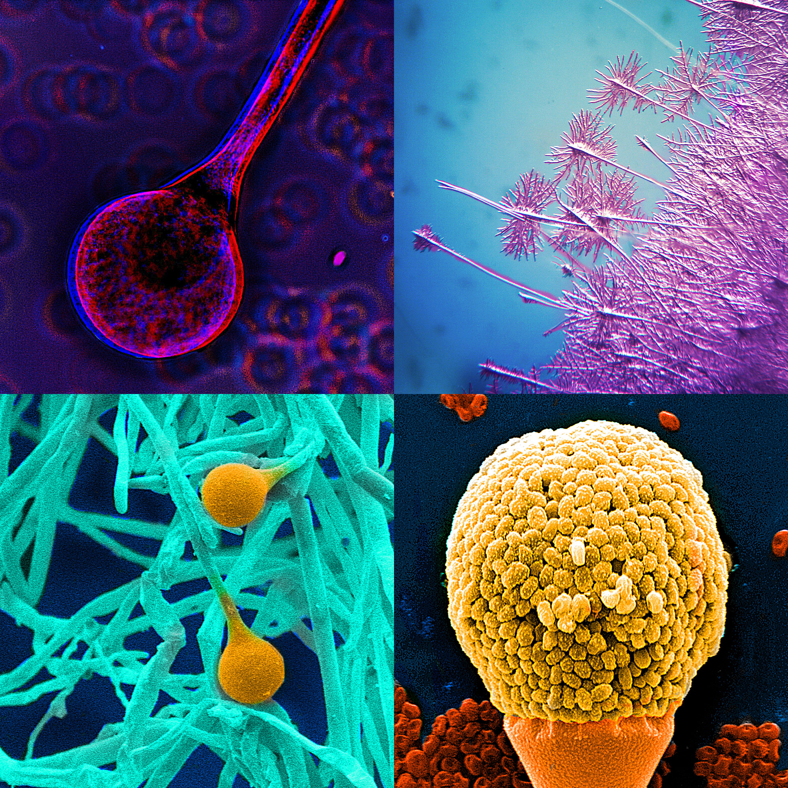
```
]
---

## 2.1. Caractéristiques générales

### Classification : au sein du "Tree of Life"<br>
LECA = dernier ancêtre commun des eucaryotes
.center[
```{r echo=F, out.width="70%"}
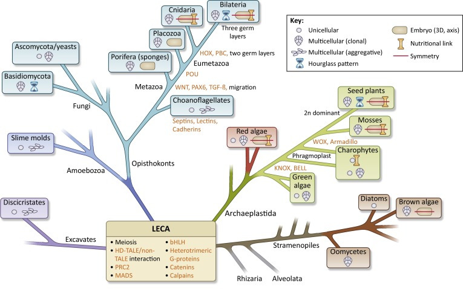
```
]

---

## 2.1. Caractéristiques générales

### Classification : au sein des "vrais champignons"

.center[
```{r, echo=FALSE, out.width="100%"}
DiagrammeR::grViz("eumycetes3.dot")
```
]

---

## 2.1. Caractéristiques générales

### Caractéristiques morphologiques<br>

- .Large[Thalle filamenteux = mycélium (ou unicellulaires comme la levure)]<br><br>
- .Large[Filaments = hyphes, se nourissent des nutriments par absorption]<br><br>
- .Large[Paroi cellulaire faite de chitine + glucanes]<br><br>
- .Large[Les hyphes peuvent être septés, ou non (coenocytiques)]<br><br>
- .Large[Certains ont un mode de vie essentiellement sous forme haploïde (ascomycètes), d'autres ont une phase dikaryotique longue (basidiomycètes)]

---

## 2.1. Caractéristiques générales

### Reproduction : asexuée et sexuée<br>

- .Large[Reproduction **asexuée** (phase anamorphe) :]<br><br>
  * .large[se réalise **pendant tout le cycle** de développement du champignon]
  * .large[assure la **multiplication** de la population et la **propagation à courte distance**]
  * .large[se réalise soit par fragmentation du thalle, soit par sporulation]
--
<br><br>
- .Large[Reproduction **sexuée** (phase téléomorphe ou forme parfaite) :]<br><br>
  * .large[se réalise en général en **fin de cycle de développement du champignon**]
  * .large[assure la **survie** et la **conservation**, mais aussi le maintien de la diversité génétique du champignon]
  * .large[se réalise par fusion de gamètes mâles et femelles]

---

## 2.1. Caractéristiques générales

### Cycle général<br>

.center[
```{r echo=F, out.width="60%"}
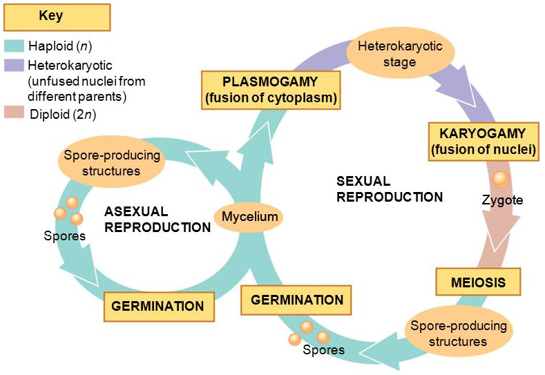
```
]

---

## 2.1. Caractéristiques générales

### Cycle des ascomycètes<br>

.center[
```{r echo=F, out.width="50%"}
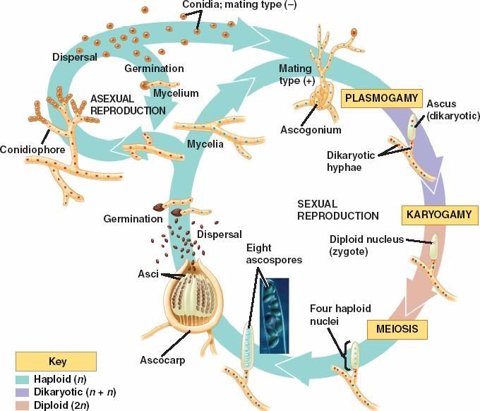
```
]

---

## 2.1. Caractéristiques générales

### Cycle des basidiomycètes<br>

.center[
```{r echo=F, out.width="45%"}
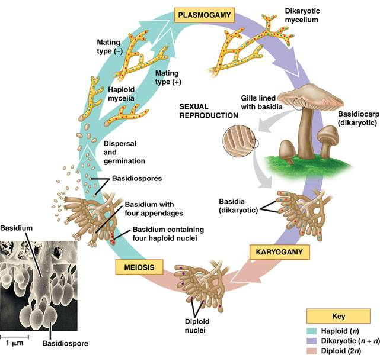
```
]

---

## 2.1. Caractéristiques générales

### Cycle des oomycètes<br>

.center[
```{r echo=F, out.width="60%"}
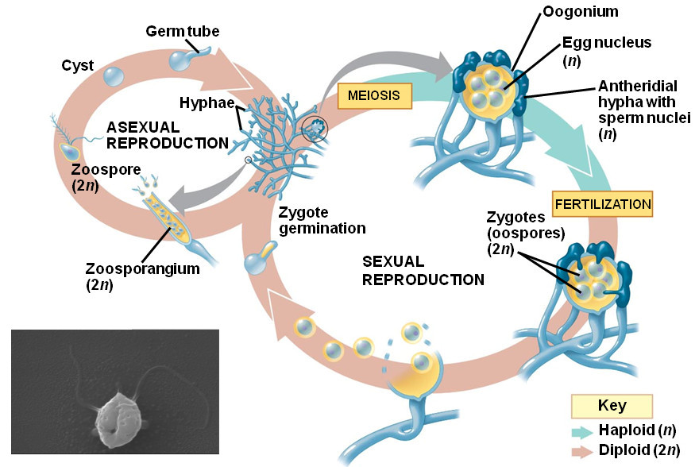
```
]

---

## 2.1. Caractéristiques générales

### Dispersion<br>

.left-column2[
.Large[1\. Libération :]
  * .large[**active :** l'organe sporifère fournit lui-même l'énergie nécessaire pour la libération des spores]
  * .large[**passive :** pas de contribution active de l'organe sporifère]

.Large[2\. Transport naturel des spores :]
  * .large[par le **vent**]
  * .large[par la **pluie**]

.Large[3\. Dépôt des spores]
]

.right-column2[
```{r echo=F, out.width="45%"}
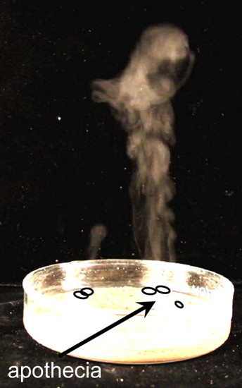
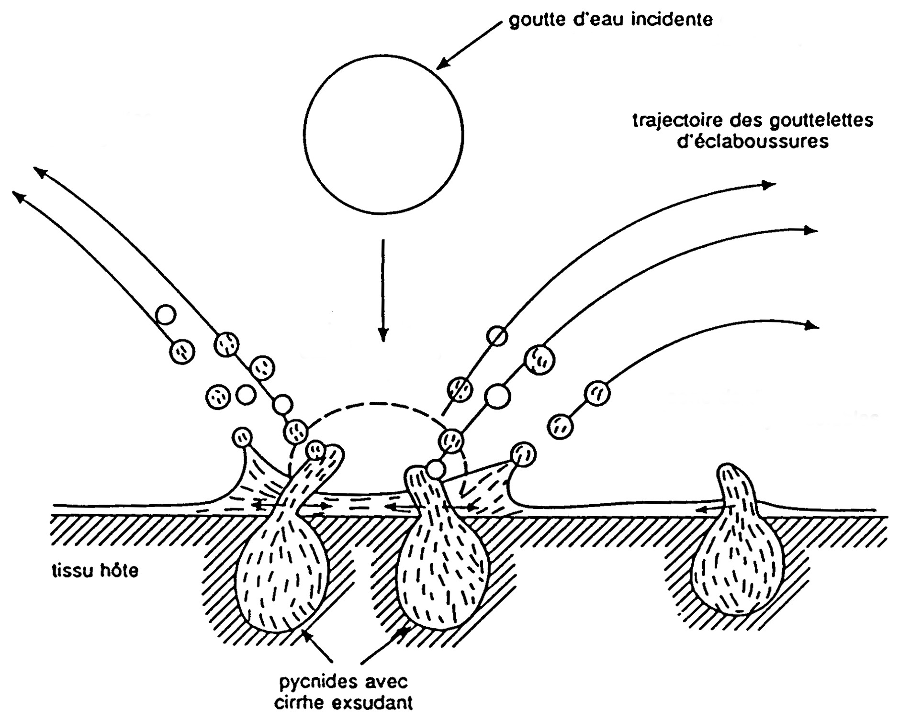
```
]

---

## 2.1. Caractéristiques générales

### Conservation<br>
.pull-left[
.Large[
- Sous la forme de **structures de résistance** (sclérotes, chlamydospores, oospores)
- Sur les débris végétaux
- Dans le sol
- Sur les repousses
- Sur des plantes réservoirs (hôtes alternatifs)
]]
.pull-right[
```{r echo=F, out.width="90%"}
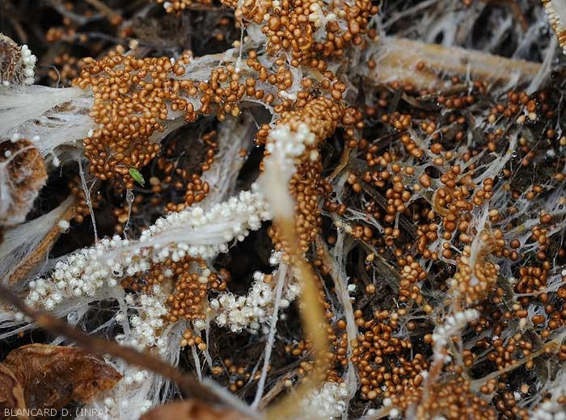
```
]

---

## 2.1. Caractéristiques générales

.left-column2[
### Exemples :

.Large[
Cercosporiose noire du bananier<br>
(*Mycosphaerella fijiensis*)
<br><br>
\- _ascomycète_ -
<br><br>
```{r echo=F, out.width="85%"}
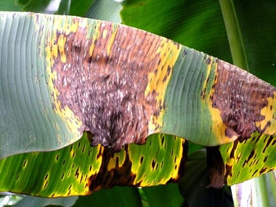
```
]
]
.right-column2[
```{r echo=F, out.width="100%"}
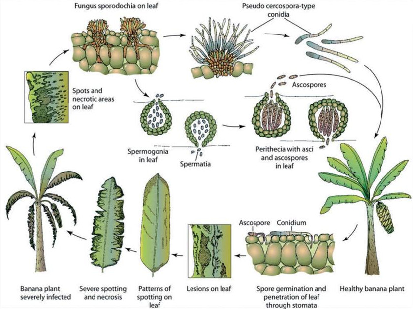
```
]

---

## 2.1. Caractéristiques générales

.left-column2[
### Exemples :

.Large[
Rouille du caféier<br>
(*Hemileia vastatrix*)
<br><br>
\- _basidiomycète_ -
<br><br>
```{r echo=F, out.width="100%"}
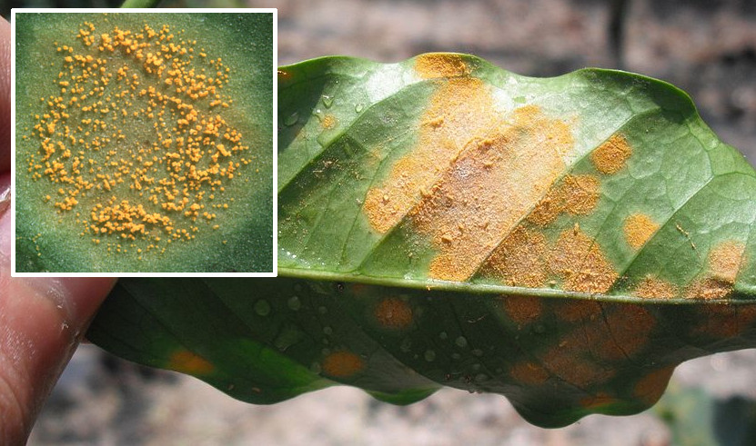
```
]
]
.right-column2[
```{r echo=F, out.width="100%"}
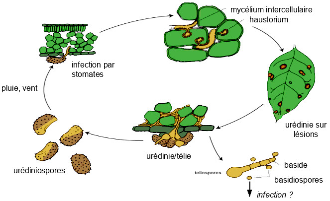
```
]

---

## 2.1. Caractéristiques générales

.left-column2[
### Exemples :

.Large[
Mildiou des cucurbitacées<br>
(*Pseudoperonospora cubensis*)
<br><br>
\- _oomycète_ -
<br><br>
```{r echo=F, out.width="100%"}
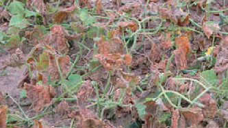
```
]
]
.right-column2[
```{r echo=F, out.width="90%"}
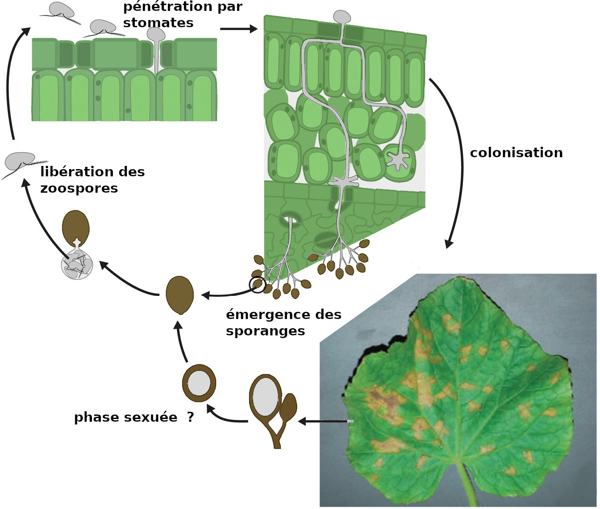
```
]

---

## 2.2. Notions d'épidémiologie

.blue-block[
.Large[
**Epidémie** = **Apparition et propagation** d'une maladie **infectieuse contagieuse** qui frappe en même temps et en un même endroit un **grand nombre** de personnes, d'animaux (épizootie) ou **de plantes** (épiphytie).]]

.Large[
- **Trois composantes importantes dans une épidémie :**
 * l'infection primaire
 * la multiplication (augmentation du nombre d'individus)
 * la dispersion à de nouveaux hôtes
<br>

- **Les objectifs de l'épidémiologie :**
 * mesurer
 * comprendre
 * identifier les pistes de lutte
]

---

## 2.2. Notions d'épidémiologie

### Diagnostic

.Large[
- Se base sur des connaissances, l'état de l'art

- Débute souvent par une reconnaissance visuelle

- Peut être complété par des techniques plus formelles :
	* prélèvements → observation → mise en culture
	* diagnostic sérologique, moléculaire (plutôt pour quarantaine)

- Permet de trouver la cause d’une maladie (étiologie)
	* abiotique / biotique
	* quel pathogène

- Permet de guider vers un choix de protection adapté
]

---

## 2.2. Notions d'épidémiologie

### Diagnostic visuel

```{r echo=F, out.width="32%"}
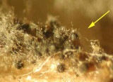
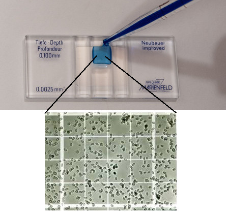
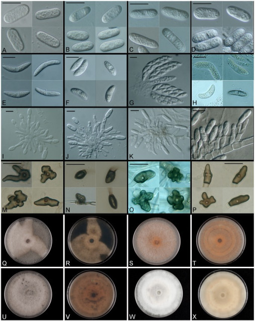
```

---

## 2.2. Notions d'épidémiologie

### Diagnostic sérologique

.pull-left[
```{r echo=F, out.width="78%"}
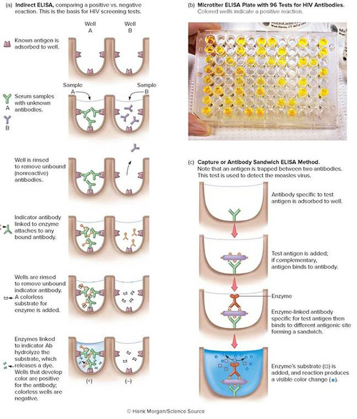
```
]

.pull-right[
```{r echo=F, out.width="80%"}
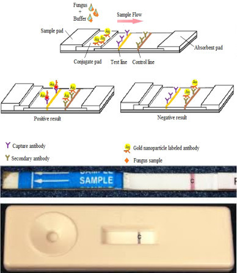
```
]

---

## 2.2. Notions d'épidémiologie

### Diagnostic moléculaire

.pull-left[
```{r echo=F, out.width="80%"}
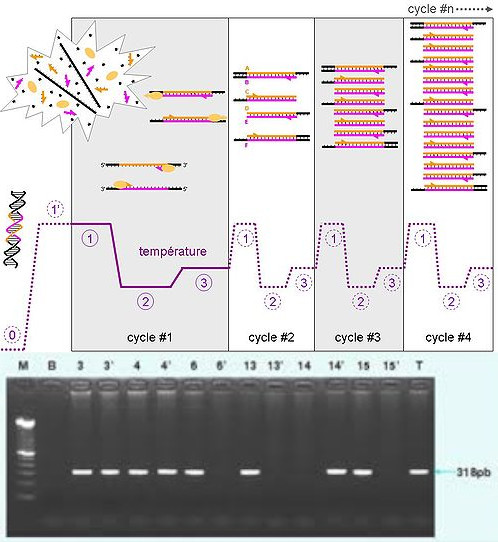
```
]

.pull-right[
```{r echo=F, out.width="100%"}
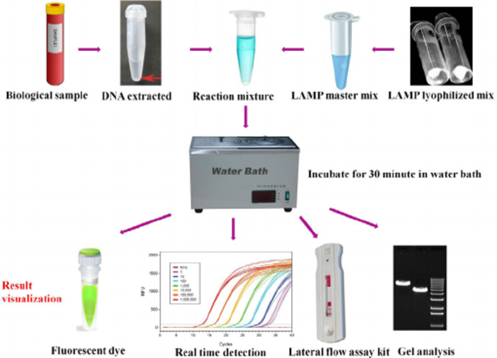
```
]

---

## 2.2. Notions d'épidémiologie

### Comment suivre l'évolution d'une épidémie

.pull-left[
.Large[
- Estimation **directe** : suivi visuel et attribution d’une valeur de sévérité (0-100%) basée sur la perception du niveau de maladie

- Utilisation d’une **échelle de notation**&nbsp;: découpage des valeurs continues en classes discrètes, attribution éventuelle de notes

- Estimation directe avec l’**utilisation d’un diagramme** : suivi visuel par l’expérimentateur et attribution d’une valeur de sévérité à l’aide d’une échelle de notation
]
]

.pull-right[
```{r echo=F, out.width="100%"}
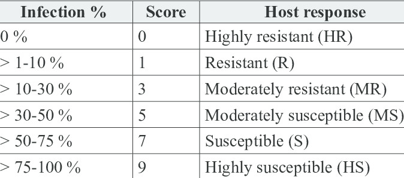
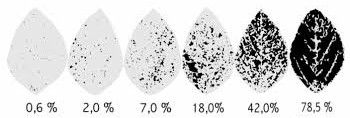
```
]

---

## 2.2. Notions d'épidémiologie

### Comment suivre l'évolution d'une épidémie

.Large[
- Pour suivre le développement de la maladie, nécessité de **définir toutes les catégories d’organes** à prendre en compte (feuille, tige, racine, fruits)
<br>

- Suivi réalisable soit par **mesure visuelle** (le plus utilisé), soit par des **mesures biochimiques, immunologiques ou moléculaires** (ELISA, PCR, PCR-Q, LAMP...)
<br>

- **Comptage des lésions difficile à réaliser** : difficulté de compter l’ensemble des lésions, mesures difficiles à réaliser sur le système racinaire
<br>

- **Alternatives** : "remote sensing" basé sur des indices de réflectance des feuilles (analyse d'images), voire sur l'émission de composés volatiles ("nez électroniques")
]

---

## 2.2. Notions d'épidémiologie

### Comment suivre l'évolution d'une épidémie

.center[
```{r echo=F, out.width="36%"}
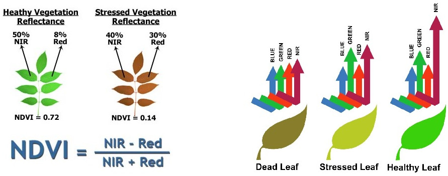
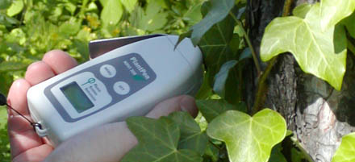
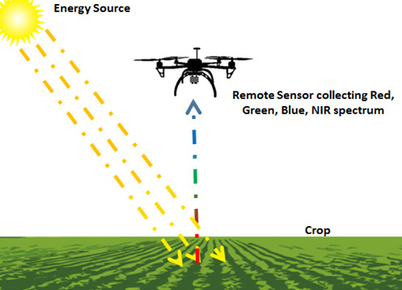
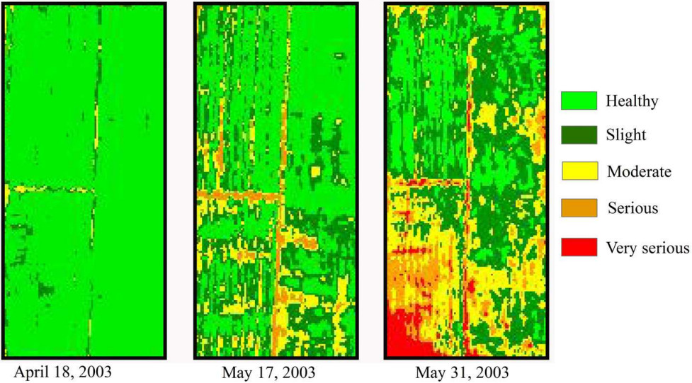
```
]

---

## 2.2. Notions d'épidémiologie

### Comparaison maladies telluriques / aériennes
<br>
.large[
```{r, echo=FALSE}
types_rel2 <- data.frame(
  Initiation=c(
    "Inoculum primaire endogène, présent avant semis",
    "Contact inoculum/racine",
    "Inoculum primaire majoritairement exogène",
    "Absent avant semis (mais pas toujours)",
    "Disponibilité inoculum/ sensibilité organe"
  ),
  Développement=c(
    "Dispersion des spores infectieuses à courte distance",
    "Contact racine-racine ou inoculum/racine",
    "Dispersion propagules infectieuses courte/longue distance",
    "",
    ""
  ))
x=kable(types_rel2) %>%
  kable_styling(bootstrap_options=c("hover", "condensed"), full_width = F) %>%
  group_rows("Telluriques", 1,2,
             label_row_css = "font-style: italic; border-bottom: 1px solid;") %>%
  group_rows("Aériennes", 3,5, label_row_css = "font-style: italic; border-bottom: 1px solid;")
x %>% gsub("<strong>", "", .) %>%
gsub("Initiation", "Initiation / Contaminations primaires", .) %>%
gsub("Développement", "Développement / Contaminations secondaires", .)

```
]

---

## 2.2. Notions d'épidémiologie

### Deux types d'épidémies

.Large[
- **Monocyclique** : développement de la maladie correspondant à un **seul cycle de développement** du parasite pendant _un cycle cultural_
.center[
```{r echo=F, out.width="40%"}
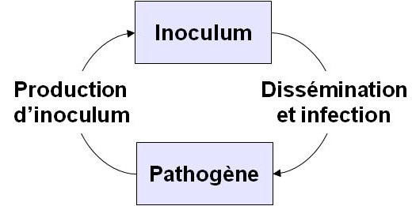
```
]
- **Polycyclique** : développement de la maladie correspondant à une juxtaposition de **multiples monocycles** pendant _un cycle cultural_
]

---

## 2.2. Notions d'épidémiologie

### Deux types d'épidémies

.center[
```{r echo=F, out.width="70%"}
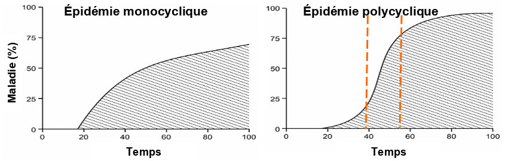
```
]
.Large[**Facteurs influançant le niveau maximal de maladie atteint en fin de culture :**
 * quantité d'inoculum primaire disponible
 * quantité de tissus ou de plantes sensibles
 * environnement (climat, microclimat)
]

---

## 2.2. Notions d'épidémiologie

### Deux types d'épidémies

.Large[Subdivision du cycle de base en 2 périodes principales :]

.large[
- Période d'incubation : temps entre la pénétration et l'apparition des symptômes
- Période de latence <b>*L*</b> : temps entre la pénétration et la production de nouvelles spores (colonisation de l’hôte)
- Période infectieuse <b>*I*</b> : durée pendant laquelle une lésion est capable de produire des spores
]

.center[
```{r echo=F, out.width="70%"}
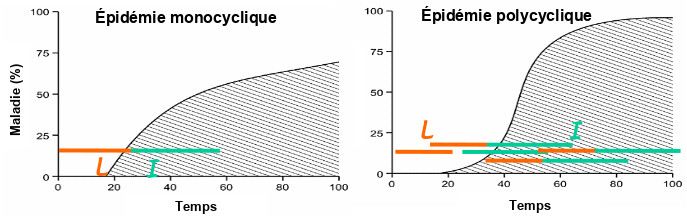
```
]

---

layout: false
class: main-slide, middle, animated, fadeIn
<div class="my-footer">
Maladies cryptogamiques : méthodes de lutte
<span>27 janvier 2020 / Master 1 Biologie Santé / Sébastien Guyader</span></div> 

# 3. Méthodes de lutte

---

layout: true
class: main-slide, animated, fadeIn
<div class="my-footer">
Maladies cryptogamiques : méthodes de lutte
<span>27 janvier 2020 / Master 1 Biologie Santé / Sébastien Guyader</span></div> 

---

## Généralités

.Large[
- Finalité : préserver le **potentiel de production** des culture
<br><br>
- C'est un objectif propre à **tous les types d'agriculture**
<br><br>
- Grande **diversité des méthodes**, en fonction :
 * de la **zone de production**
 * des **objectifs de production**
 * du **système de culture** choisi
<br><br>
- Du **préventif** au **curatif**
]

---

## Généralités

### Cinq grands groupes de méthodes :

.Large[
<br>
- Chimique<br><br>
- Génétique<br><br>
- Biocontrôle<br><br>
- Prophylactique<br><br>
- Intégrée
]

---

## 3.1. Méthode chimique

.Large[
.blue-block[
Méthode de lutte basée sur l'utilisation de produits phytopharmaceutiques issus de la
chimie de synthèse.
]
]

### Biocides et produits désinfectants/stérilisants
.Large[
- ex. : bouillie bordelaise, fumigation et désinfection des sols
- peu sélectifs
- moins couramment utilisés
]

### Fongicides
.Large[
- plus largement utilisés
- différentes cibles d'action sur le pathogène
- différents modes d'utilisation
]

---

## 3.1. Méthode chimique

.Large[
- Nombreuses familles de fongicides (de nouvelles sont créées encore aujourd'hui)

.center[
```{r echo=F, out.width="60%"}
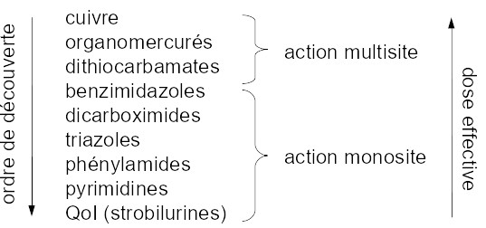
```
]

- Trois grandes catégories d'utilisation : contact, translaminaires/localement systémiques, systémiques
- Essentillement utilisés à titre préventif, rarement curatif
]

---

## 3.1. Méthode chimique

.center[
```{r echo=F, out.width="50%"}
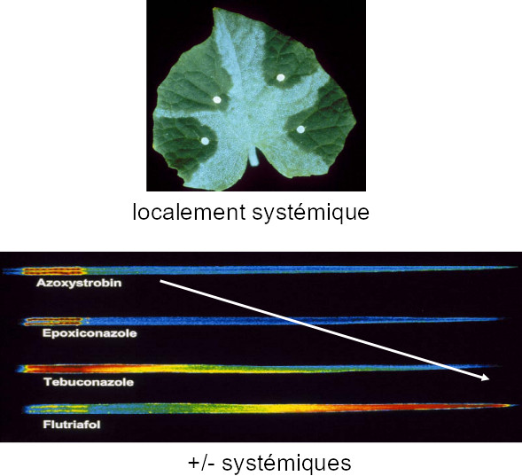
```
]

---

## 3.1. Méthode chimique

.Large[
- Problèmes liés à la méthode chimique :
 * efficacité liée aux conditions
 * apparition de souches résistantes
 * toxicité pour les personnes faisant l’application
 * toxicité pour l’environnement (manque de sélectivité)
 * coût
	
- Nombre de traitements annuels pour quelques cultures :
 * blé : 6.6
 * maïs : 3.7
 * colza : 6.7
 * pommier : 17.6
 * vigne : 20
]

---

## 3.1. Méthode chimique

.center[
```{r echo=F, out.width="90%"}
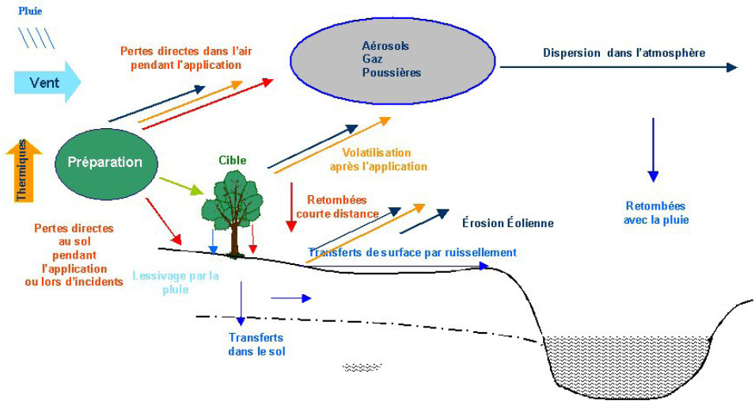
```
]

---

## 3.2. Méthode génétique

.Large[
.blue-block[
Utilisation de variétés résistantes (naturellement, ou par modification) &nbsp;
]

- Un ou plusieurs gènes :<br>
 résistances mono-, oligo- ou polygéniques
<br><br>
- Résistances **totales** :<br>
 en général monogéniques, à effet très fort, mais on peut introgresser 2 ou plusieurs gènes dans une même variété (pyramidage)
<br><br>
- Résistances **partielles** ou **quantitatives** :<br>
 souvent oligo- ou polygéniques, avec un effet moins fort
]

---

## 3.2. Méthode génétique

.Large[Résistance **monogénique** : gène de type **R**, effet _qualitatif_ fort]
<br><br>
.center[
```{r echo=F, out.width="60%"}
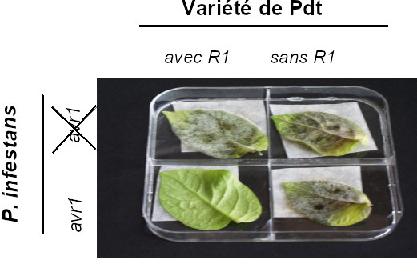
```
]

---

## 3.2. Méthode génétique

.Large[Résistance **polygénique** partielle : effet _quantitatif_]
<br><br>
.center[
```{r echo=F, out.width="80%"}
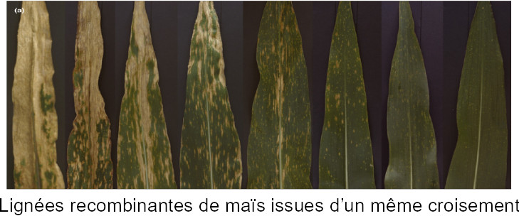
```
]

---

## 3.2. Méthode génétique

.Large[Problème des résistances "simples" : elles sont plus facilement **contournées**]
<br><br>
.center[
```{r echo=F, out.width="65%"}
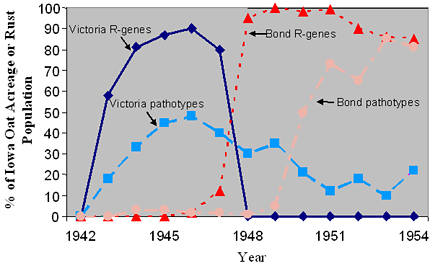
```
]

---

## 3.3. Biocontrôle

.blue-block[
.Large["L’ensemble des méthodes de *protection des végétaux* qui utilisent des **mécanismes naturels**. Il vise à la protection des plantes en privilégiant l’utilisation de mécanismes et d’interactions qui régissent les relations entre espèces dans le milieu naturel"
]
]
<br>

.Large[
Ces agents sont habituellement classés en 2 grandes catégories :

- les **macro-organismes** invertébrés
- les **produits phytopharmaceutiques** de biocontrôle :
  * les micro-organismes
  * les médiateurs chimiques tels que les phéromones, les substances allélochimiques (allomones et kairomones) et les phytophéromones
  * les substances naturelles d'origine animale, végétale ou minérale
]

---

## 3.3. Biocontrôle

.center[
```{r echo=F, out.width="50%"}
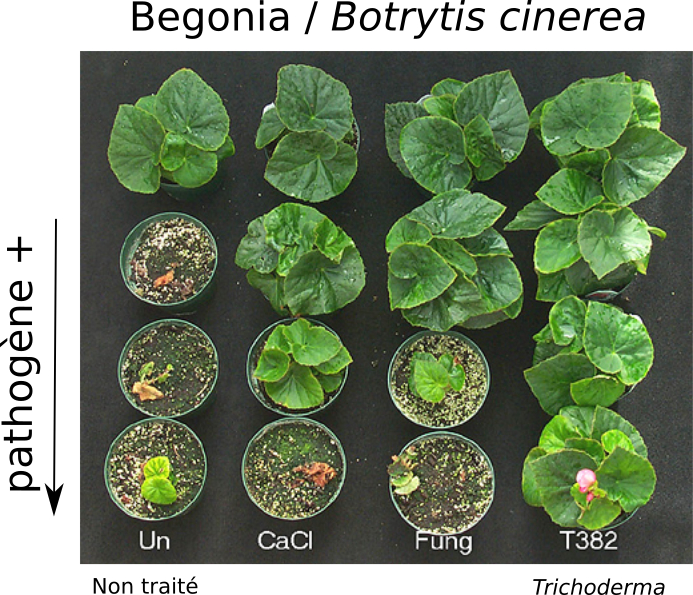
```
]

---

## 3.4. Méthodes prophylactiques / préventives

.blue-block[
.Large[Ensemble des **techniques culturales** visant à **éviter ou réduire les risques** d’infection (efficaces particulièrement pour les maladies à faible dispersion)
]
]

.Large[Possibilités variées, en fonction des pathosystèmes :]
.large[
* éviter un sol infecté (rotation)
* utilisation d’une plante assainissante en interculture (allélopathie)
* désinfecter le sol (solarisation) 
* partir de matériel sain pour plantation (semences certifiées…)
* éliminer hôtes alternatifs à proximité
* planter loin d’une culture infectée la saison précédente
* éliminer les résidus infectieux
* jouer sur les conditions méso/microclimatiques
* décaler la culture dans le temps pour désynchroniser stades sensibles / conditions favorables à la maladie
* détruire les tissus/plantes infectés en cours de culture
* éviter dispersion d’inoculum par les intervenants
* ...
]

---

## 3.5. Protection intégrée

<br>
.blue-block[
.Large[
Prise en considération attentive de **toutes les méthodes** de protection des plantes
disponibles et, par conséquent, intégration des mesures appropriées qui découragent
le développement des populations d’organismes nuisibles et maintiennent le recours
aux produits phytopharmaceutiques et à d’autres types d’interventions **à des niveaux
justifiés** des points de vue économique et environnemental, et **réduisent ou limitent
au maximum les risques** pour la santé humaine et l’environnement.
]
]

---

## 3.5. Protection intégrée

<br>
.large[
```{r, echo=FALSE}
types_rel2 <- data.frame(
  Lutte=c(
    "Contre un pathogène, au moins 2 méthodes de lutte complémentaires",
    "Risque de les réfléchir et concevoir bioagresseur par bioagresseur",
    "Risque de se trouver face à des incompatibilités ou conflits entre méthodes"
  ),
  Protection=c(
    "Se raisonne au niveau de la (des) culture(s)",
    "Consiste à créer les conditions des cultures les moins favorables aux bioagresseurs, y-compris par des moyens directs de lutte",
    "Développée à partir de profils de bioagresseurs majeurs"
  ))
x=kable(types_rel2) %>%
  kable_styling(bootstrap_options=c("hover", "condensed"), full_width = T) %>%
  column_spec(1:2, width = "20em")
x %>%
gsub("Lutte", "Lutte intégrée", .) %>%
gsub("Protection", "Protection intégrée", .)

```
]

---

## 3.5. Protection intégrée

.center[
```{r echo=F, out.width="80%"}
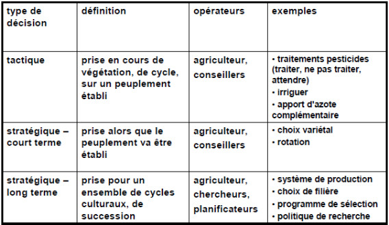
```
]

---

## 3.5. Protection intégrée

### Protéger une culture, c'est (mais pas uniquement) :

.Large[
- réduire la quantité d'ennemis des cultures qui l'attaquent
- réduire la vitesse d'une épidémie causée par un bioagresseur donné 
- réduire, cycle après cycle, la taille des populations d'un groupe de bioagresseurs, 
(ce n’est pas annihiler l'ensemble des bioagresseurs qui affectent une culture)
]

### Objectif ultime : réduire les pertes de récoltes (nuisibilité)

.Large[
- comment qualifier une perte de récolte, s'agit-il uniquement de pertes en biomasse récoltée ?
- jusqu'à quel niveau cette perte est-elle tolérable ?
]

---

## 3.5. Protection intégrée

### Importance de définir des seuils

.Large[
- **Seuil de nuisibilité "biologique" :**<br>
 Niveau d’intensité de la maladie à partir de laquelle une diminution des potentialités de la plante cultivée est observée

- **Seuil de nuisibilité économique :**<br>
Niveau d’intensité de maladie justifiant la mise en œuvre de moyens de lutte, lorsque la perte économique est supérieure au coût de contrôle pouvant l’éviter]
<br>
.Large[
Dépend de la balance coûts de la lutte / revenus de la culture
<br><br><br>
.indent[.indent[**`r anicon::faa("hand-point-right", speed="slow")` Utilisation de modèles de nuisibilité et d’économie**]]
]

---

## 3.5. Protection intégrée

.left-column3[
```{r echo=F, out.width="90%"}
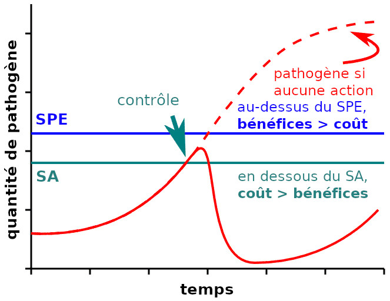
```
]


.Large[
.right-column3[
<br><br><br><br><br>
**SPE** = seuil de pertes économiques
<br>
**SA** = seuil d'action
]
]
