```{r setup, include=FALSE, message=FALSE}
options(htmltools.dir.version = FALSE)
library(knitrBootstrap)
library(anicon)
library(icon)
library(kableExtra)
```

class: title-slide, animated, fadeIn

# Maladies cryptogamiques : pathogénèse et réponses de l'hôte
### Sébastien GUYADER
#### INRA - UR Astro - Petit-Bourg

---

layout: true
class: main-slide, animated, fadeIn
<div class="my-footer"><span>S. Guyader &nbsp; - &nbsp; Maladies cryptogamiques : pathogénèse et réponses de l'hôte</span></div> 

---
name: plan

.left-column[
# Plan
]

.right-column[
<br>
###1. Introduction
  1.1. L'état normal de la plante<br>
  1.2. Interactions plantes/microbes<br>
  1.3. Relations trophiques plantes / champignons pathogènes<br>
  1.4. Conséquences des interactions<br>
  {{content}}
]
--
###2. Immunité, résistance et sensibilité
  2.1. Mécanismes de reconnaissance de l'agression<br>
  2.2. Contre-attaque du pathogène<br>
  2.3. Différences entre types d'interactions (biotrophes/nécrotrophes)<br>
{{content}}
--
###3. Perturbations physiologiques et symptômes
  3.1. Différents types de symptômes<br>
  3.2. Effets des perturbations<br>
{{content}}
<br>
---

layout: false
class: section-slide, inverse, center, middle, animated, fadeIn
<div class="my-footer"><span style="color:white">S. Guyader &nbsp; - &nbsp; Maladies cryptogamiques : pathogénèse et réponses de l'hôte</span></div>

# 1. Introduction

---

layout: true
class: main-slide, animated, fadeIn
<div class="my-footer"><span>S. Guyader &nbsp; - &nbsp; Maladies cryptogamiques : pathogénèse et réponses de l'hôte</span></div>

---

## 1.1. L'état normal de la plante

.center[
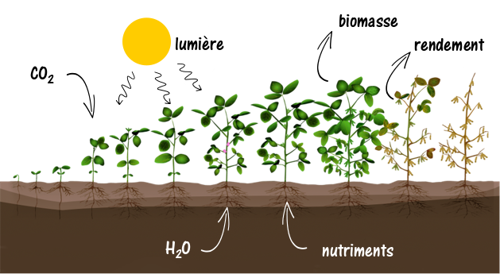
]

--
<br>
.center[
.content-box-brown[
.large[
`r anicon::faa("hand-point-right", speed="slow")` Une attaque par des pathogènes conduit à une .bold[modification] de cet état
]
]
]

---

## 1.2. Interactions plantes/microbes

### `r icon::fa("caret-right")` Deux grands types d'interaction plante/microbe :
.pull-left[
- .Large[Interaction compatible :] maladie
 - progression de l'infection
 - dommages sur la plante
]
.pull-right[
- .Large[Interaction incompatible :] immunité
 - immunité basale .strong["MTI"]
 - immunité indirecte .strong["ETI"]
]

--
.center[
```{r echo=FALSE, out.width="75%"}
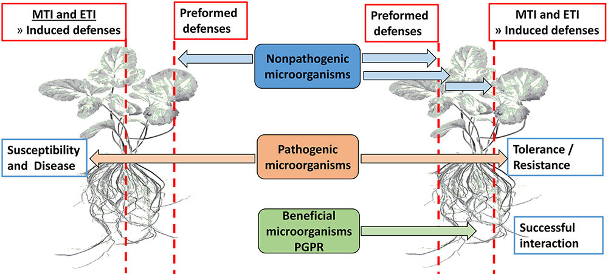
```
]

---

## 1.3. Relations trophiques plantes / Champignons phytopathogènes

### `r icon::fa("caret-right")` Types de relations trophiques / modes de vie des champignons :
<br><br>

```{r, echo=FALSE}
types_rel1 <- data.frame(
  Types=c(
    "Saprotrophes",
    "Nécrotrophes",
    "Biotrophes"
  ),
  Définition=c(
    "Survivent uniquement sur des débris, tissus en décomposition",
    "Opportunistes, envahissent des tissus en produisant des facteurs cytolytiques pour utiliser les tissus dégradés",
    "Dépendent des tissus vivants de leur hôte pour leur croissance"
  )
)
kable(types_rel1) %>%
  kable_styling(c("hover", "condensed"), full_width = T) %>%
  column_spec(1, bold=T, width = "15em")
```
--
```{r, echo=FALSE}
types_rel1bis <- data.frame(
  Types=c(
    "Hémibiotrophes"),
  Définition=c(
    "Cycle en 2 phases : d'abord biotrophes, puis nécrotrophes")
)
x=kable(types_rel1bis) %>%
  kable_styling(bootstrap_options=c("hover", "condensed"), full_width = T) %>%
  column_spec(1, bold=T, width = "15em")
gsub("<thead>.*</thead>", "", x)
```

---

## 1.3. Relations trophiques plantes / Champignons phytopathogènes

### `r icon::fa("caret-right")` Types de relations trophiques / modes de vie des champignons :
<br>
```{r, echo=FALSE}
types_rel2 <- data.frame(
  Biotrophes=c(
    "Cellules hôtes tuées lentement",
    "Pas ou peu de toxines produites",
    "Formation de structure parasitaire (haustorium)",
    "Pénétration via blessures, ouvertures naturelles",
    "Faible gamme d’hôtes",
    "Incapables de se développer en saprophyte",
    "Attaquent les tissus sains"
  ),
  Nécrotrophes=c(
    "Cellules hôtes tuées rapidement",
    "Production de toxines et enzymes cytolytiques",
    "Pas de formation de structure parasitaire spéciale",
    "Pénétration directe ou via ouvertures naturelles",
    "Importante gamme d’hôtes",
    "Capables de se développer en saprophyte",
    "Attaquent tous les types de tissus (jeunes, matures, sénescents)"
  ))
x=kable(types_rel2) %>%
  kable_styling(bootstrap_options=c("hover", "condensed"), full_width = F) %>%
  group_rows("Morphologiques et biochimiques", 1, 4,
             label_row_css = "font-style: italic; border-bottom: 1px solid;") %>%
  group_rows("Ecologiques", 5,7, label_row_css = "font-style: italic; border-bottom: 1px solid;")
gsub("<strong>", "", x)
```

---

## 1.3. Relations trophiques plantes / Champignons phytopathogènes

### `r icon::fa("caret-right")` Types de relations trophiques / modes de vie des champignons :
<br>
.center[
```{r echo=F, out.width="50%"}
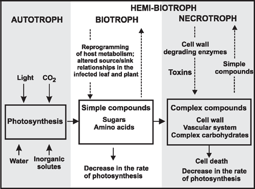
```
]

---

## 1.4. Conséquences des interactions

### `r icon::fa("caret-right")` Suite à une attaque, le fonctionnement de la plante est modifié à plusieurs niveaux :
<br>

- .Large[Moléculaire :]
 - reconnaissance de l'attaque `r icon::fa("long-arrow-alt-right")` signalisation moléculaire
 - niveau local (défense sur le site) et systémique (prémunition)
<br><br>
--

- .Large[Physiologique :]
 - dus à la mise en place de mécanismes de défense
 - dus à l'expression du pathogène
<br><br>
--

- .Large[Organes, plante :]
 - dus à l'expression du pathogène
 - dégâts, symptômes visibles
 
---

layout: false
class: section-slide, inverse, center, middle, animated, fadeIn
<div class="my-footer"><span style="color:white">S. Guyader &nbsp; - &nbsp; Maladies cryptogamiques : pathogénèse et réponses de l'hôte</span></div>

# 2. Immunité, résistance et sensibilité

---

layout: true
class: main-slide, animated, fadeIn
<div class="my-footer"><span>S. Guyader &nbsp; - &nbsp; Maladies cryptogamiques : pathogénèse et réponses de l'hôte</span></div>

---

## 2.1. Mécanismes de reconnaissance de l'agression

### 2.1.1 Réponse immunitaire basale : PTI (PAMP-triggered immunity)

.Large[PAMP : "pathogen-associated molecular pattern"]
<br>
.indent[](MAMP : microbe-associated molecular pattern `r icon::fa("long-arrow-alt-right")` induisent la .bold[MTI]) <br>
.indent[]Ce sont des molécules constituantes des microbes (chitine, LPS...), dont certains motifs sont reconnus par des .bold[PRR] <br>
<br>
.Large[PRR : "Pattern recognition receptor", récepteurs transmembranaires de l'hôte]
<br>
--
.left-column2[
<br><br><br>
.bold[domaine extracellulaire :] interaction récepteur/ligand, souvent via un domaine LRR ("leucine rich repeat")
<br><br><br><br><br>
.bold[domaine intracellulaire :] interaction avec kinases, cascade de phosphorylations<br>
`r icon::fa("long-arrow-alt-right")` signal
]
.right-column2[
```{r echo=F, out.width="90%"}
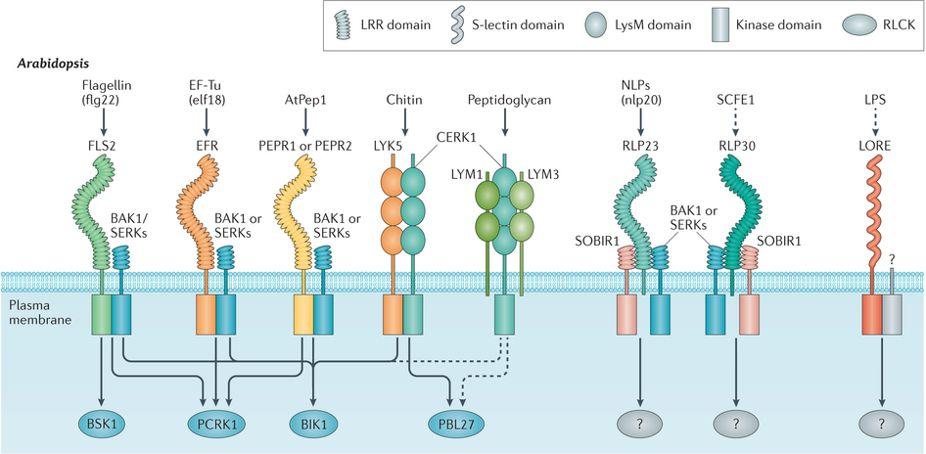
```
]

---

## 2.1. Mécanismes de reconnaissance de l'agression

### 2.1.1. Réponse immunitaire basale : PTI (PAMP-triggered immunity)

.pull-left[
```{r echo=F, out.width="100%"}
knitr::include_graphics("./images/pti.jpg")
```
]
--
<br>
.pull-right[
1. fixation .strong[PAMP/PRR]
{{content}}
]
--
2. activation des <b>kinases</b>
{{content}}
--
3. influx de <b>Ca<sup>2+</sup></b>
{{content}}
--
4. burst <b>oxydatif</b> (activité antimicrobienne et signal d'activation)
{{content}}
--
5. augmentation synthèse <b>SA</b> (=salicilic acid) dans les cas des biotrophes, ou <b>JA/ET</b> (=jasmonic acid et ethylene) dans le cas des nécrotrophes ou de blessures
{{content}}
--
6. induction expression des gènes impliqués dans la <b>défense</b> (protéines PR = "Pathogenesis related")
{{content}}
--
7. transmission <b>systémique</b> du signal par SA et JA/ET
{{content}}
--
<br><br>
> `r icon::fa("long-arrow-alt-right")` défense au niveau local et prémunition à l'échelle de la plante : <b>SAR</b>="systemic acquired resistance"

---

## 2.1. Mécanismes de reconnaissance de l'agression

### 2.1.2. Réponse immunitaire indirecte : ETI (effector-triggered immunity)
- .large[Les pathogènes peuvent "injecter" certaines molécules pour faciliter l'infection : ce sont des <b>éliciteurs</b>]
--
<br>
- .large[Les plantes ont développé la capacité de <b>détecter</b> certaines de ces molécules spécifiques à l'infection]
--
<br>
- .large[Comme dans le cas de la PTI, il y a une <b>reconnaissance éliciteur/récepteur</b>, qui induit une réponse de la plante (parfois reconnaissance indirecte d'un changement induit au niveau de protéines de l'hôte)]
--
<br>
- .large[Souvent les récepteurs sont de type <b>NB-LRR</b> (nucleotide binding - leucine rich repeat)]
--
<br>
- .large[A la différence des PRR qui sont transmembranaires, les protéines R sont <b>cytosoliques</b>]
--
<br>
- .large[On parle de protéines <b>R</b> ("résistance") pour le récepteur, et de facteur <b>avr</b> ("avirulence") pour l'éliciteur]
--
<br>
- .large[La réponse ETI est en général <b>+ rapide et + intense</b> que la PTI]
--
<br>
- .large[En plus du burst oxydatif et de l'activation des voies de défense, une spécificité est la <b>réaction hypersensible</b> (HR) : mort cellulaire programmée pour endiguer l'infection (biotrophes)]
--
<br>
- .large[Toutefois, ETI et PTI partagent largement les mêmes voies de signalisation et d'activation]

---

## 2.1. Mécanismes de reconnaissance de l'agression

### 2.1.2. Réponse immunitaire indirecte : ETI (effector-triggered immunity)

.center[
```{r echo=F, out.width="50%"}
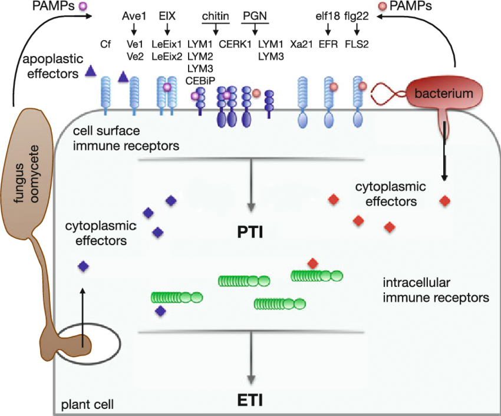
```
]

---

## 2.1. Mécanismes de reconnaissance de l'agression

### 2.1.2. Réponse immunitaire indirecte : ETI (effector-triggered immunity)

.pull-left[
<br><br><br>
.large[Modèle "direct" gène-pour-gène :]
<br><br>
```{r echo=F, out.width="70%"}
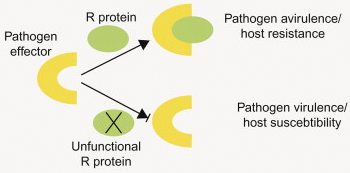
```
]

--

.pull-left[
.large[Modèle "gardien" :]
```{r echo=F, out.width="88%"}
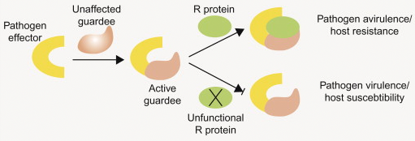
```
.large[Modèle "leurre" :]
```{r echo=F, out.width="88%"}
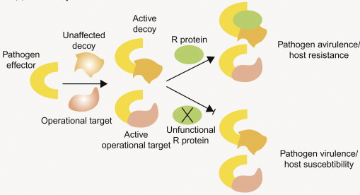
```
]

---

## 2.2. Contre-attaque du pathogène

### `r icon::fa("caret-right")` Rôle des éliciteurs

.pull-left[
- Certains éliciteurs produits par les pathogènes sont des .strong[suppresseurs de PTI] :
 - en interférant avec la cascade de phosphorylation
 - en interférant avec la signalisation hormonale (SA/JA/ET)
 - une suppression efficace amène à l'.strong[ETS] (effector-triggered susceptibility)

<br>
- Les éliciteurs .strong[avr] reconnus par les gènes .strong[R] sont soumis à une sélection :
 - pour échapper à le reconnaissance des récepteurs de l'hôte
 - pour supprimer activement l'ETI

<br>
- Il y a coévolution entre les gènes codant pour les éliciteurs .strong[avr] et pour protéines .strong[R] correspondantes
]

.pull-right[
```{r echo=F, out.width="90%"}
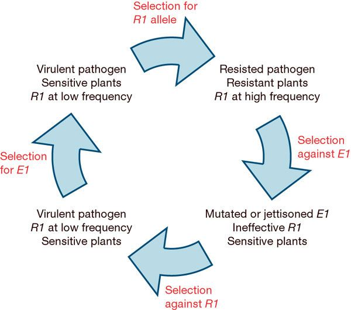
```
]

---

## 2.2. Contre-attaque du pathogène

### `r icon::fa("caret-right")` Schéma synthétique en "zigzag"

.center[
```{r echo=F, out.width="60%"}
knitr::include_graphics("./images/zig-zag.jpg")
```
]

---

## 2.3. Différences entre types d'interactions (biotrophes/nécrotrophes)
<br><br>

- .Large[Biotrophes :]
 - induction quasi-systématique de la .strong[voie SA], conduisant à la mort cellulaire
 - si la voie JA/ET est induite, elle est efficace
<br><br>
- .Large[Nécrotrophes :]
 - la mort cellulaire est inefficace
 - la PTI est déclenchée par des PAMPs ou des éliciteurs (toxines)
 - très peu de gènes R connus pour conférer la résistance
 - au contraire, des récepteurs type NB-LRR sont cette fois la cible de toxines et confèrent la sensibilité (ETS)
 - induction de la .strong[voie JA/ET] en général, et production de molécules de défense type "phytoalexines"
 <br><br>
- .Large[Les voies SA et JA/ET sont .strong[antagonistes] :] l'induction d'une des voies inhibe l'autre

---

## 2.3. Différences entre types d'interactions (biotrophes/nécrotrophes)
<br><br>
.center[
```{r echo=F, out.width="70%"}
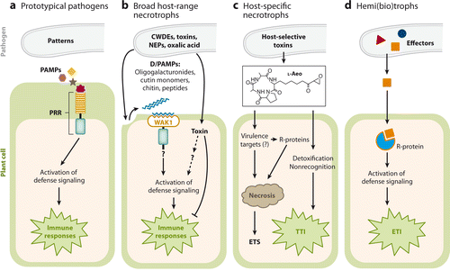
```
]

---

## 2.3. Différences entre types d'interactions (biotrophes/nécrotrophes)
<br><br>

.pull-left[
.Large[Biotrophe]
```{r echo=F, out.width="100%"}
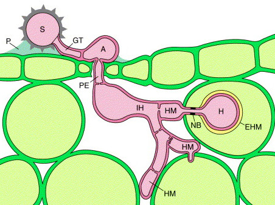
```
]
.pull-right[
.Large[Hémibiotrophe]
```{r echo=F, out.width="100%"}
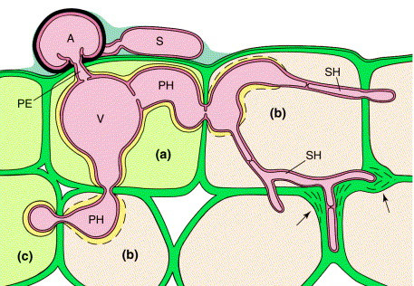
```
]

---

layout: false
class: section-slide, inverse, center, middle, animated, fadeIn
<div class="my-footer"><span style="color:white">S. Guyader &nbsp; - &nbsp; Maladies cryptogamiques : pathogénèse et réponses de l'hôte</span></div>

# 3. Perturbations physiologiques et symptômes

---

layout: true
class: main-slide, animated, fadeIn
<div class="my-footer"><span>S. Guyader &nbsp; - &nbsp; Maladies cryptogamiques : pathogénèse et réponses de l'hôte</span></div>

---

## 3.1. Différents types de symptômes
### `r icon::fa("caret-right")` Définitions :
- .Large[Symptôme :]
 >Modification du phénotype par rapport à un état normal
--
<br>
- .Large[Dégât :]
 >Altération de la culture due à l’activité de l’agent responsable de la maladie ou du ravageur
--
<br>
- .Large[Dommage :]
 >Perte du potentiel de la culture (réduction du rendement en quantité et/ou en qualité)
--
<br>
- .Large[Perte :]
 >Perte économique liée à la présence d’un bioagresseur dans une culture, provenant d’une baisse de rendement et/ou d’un déficit de qualité de la production
 
---

## 3.1. Différents types de symptômes
### `r icon::fa("caret-right")` Exemples de symptômes :

.left-column2[

- Modification de couleur :<br>
*anthacyanose, chlorose, mélanose*

- Altération des organes :<br>
*nécrose, pourriture, flétrissement*

- Modification des fleurs 

- Anomalies de croissance :<br>
*nanisme, déformation organes*

- Anomalies internes :<br>
*callose, thyllose, gomme,…*

- Excroissances pathologiques :<br>
*gales, galles, tumeurs*
]

.right-column2[
.center[
```{r echo=F, out.width="22%"}
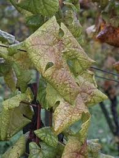
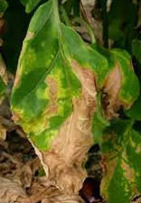
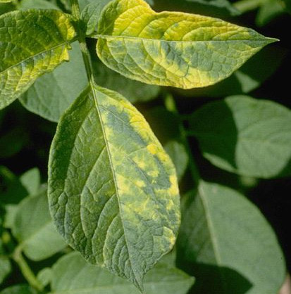
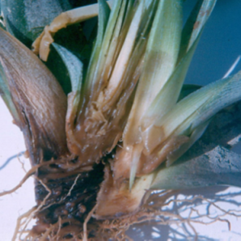

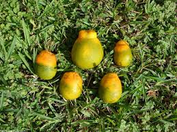
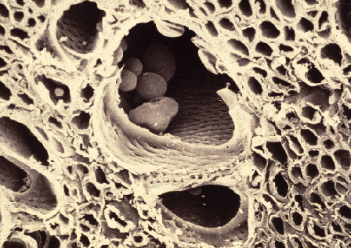
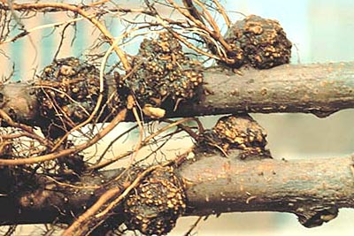
```
]
]

---

## 3.2. Effets des perturbations

### `r icon::fa("caret-right")` Effets sur la membrane plasmique :

.left-column3[
- L'émission de toxines et/ou d'enzymes (pectinases, phospholipases) modifie la .strong[perméabilité membranaire] :
 * dégradation de la lignine, celullose, hémicellulose
 * inhibition de la fonction de protéines de surface
 * modification de l'activité ATPase et des canaux inoniques
 * action aussi sur les membranes des organites (chloroplastes, mitochondries)
 * accumulation de formes actives d'oxygène
<br><br>
- Impact sur : 
 * la régulation des .strong[échanges ioniques]
 * le .strong[transfert des assimilats] (produits dela photsynthèse) par la cellule
 * .strong[ouverture des stomates] (fuite accélérée de l'eau intercellulaire)
 * la .strong[transduction du signal] d'activation des gènes de défense
]

.right-column3[
```{r echo=F, out.width="90%"}
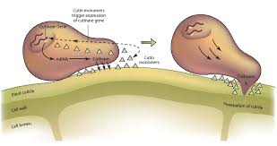
```
]

---

## 3.2. Effets des perturbations

### `r icon::fa("caret-right")` Effets sur la respiration :

.pull-left[
<br>
.large[Augmentation générale de la respiration]
<br><br>

- .strong[Décomposition des tissus] (par les nécrotrophes) :<br>
 augmentation liée à l’induction des mécanismes de défense, puis chute liée à la mort des tissus
<br><br>

- .strong[Détournement du métabolisme] des cellules (par les biotrophes) :<br>
 augmentation liée à la création d’un nouveau puits pour la plante
<br><br>

- .strong[Activation] de certaines voies métaboliques
]

.pull-right[
.center[
```{r echo=F, out.width="80%"}
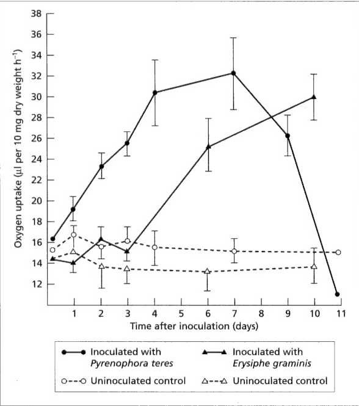
```
]
]

---

## 3.2. Effets des perturbations

### `r icon::fa("caret-right")` Effets sur la photosynthèse :

.pull-left[
<br>
.large[Facteurs physiques]
<br><br>

- modification de la .strong[géométrie des feuilles] (moindre interception du rayonnement)
<br><br>

- perte de .strong[surface foliaire] efficace (nécrose, pourriture, chlorose...)
<br><br>
```{r echo=F, out.width="70%"}
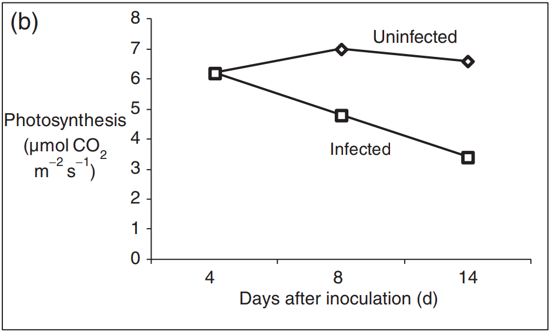
```
]

.pull-right[
.center[
```{r echo=F, out.width="60%"}
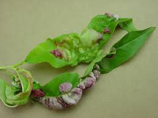
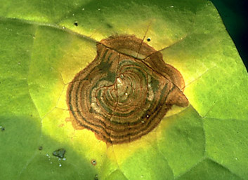
```
]
]

---

## 3.2. Effets des perturbations

### `r icon::fa("caret-right")` Effets sur la photosynthèse :

.pull-left[
<br>
.large[Facteurs biochimiques et métaboliques]
<br><br>

- dégradation de la .strong[chlorophylle] : action d'enzymes et de toxines (nécrotrophes), effet rétro-actif inhibant la photosynthèse (biotrophes)
<br><br>

- altération des .strong[chloroplastes] : mort des cellules (toxines), perméabilité membranaire, modification structurelle
]

.pull-right[
.center[
```{r echo=F, out.width="70%"}
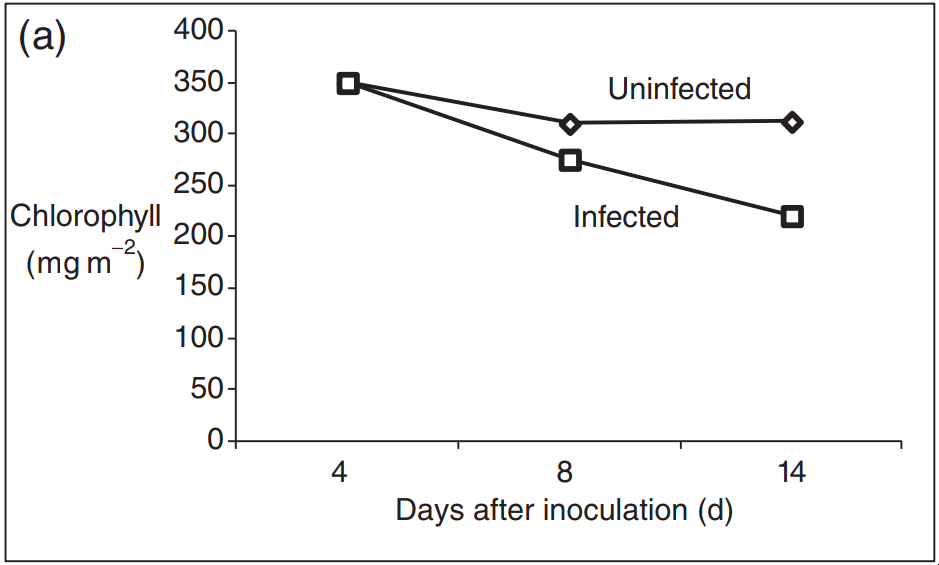
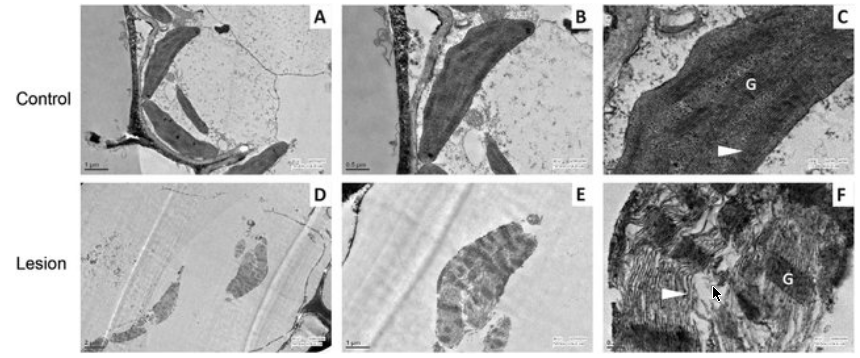
```
]
]


---

## 3.2. Effets des perturbations

### `r icon::fa("caret-right")` Effets sur le métabolisme :

.pull-left[
<br>
- .large[Inhibition du .strong[transfert d'électrons] :]

 * inhibition du mécanisme de couplage de la .strong[photophosphorylation]
 * perte de composants de la chaîne de .strong[transfert des électrons]
<br><br>

- .large[Blocage de la synthèse d'.strong[ATP] par séquestration du P<sub>i</sub>]
<br><br>

- .large[Réduction de l'activité des enzymes du .strong[cycle de Calvin] (RuBisCO, NADPH-GADPH, FBPase, 3PGK), stimulation de l'activité d'autres enzymes]
<br><br>
]

.pull-right[
.center[
```{r echo=F, out.width="58%"}
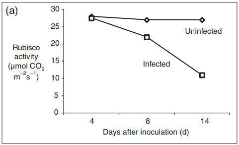
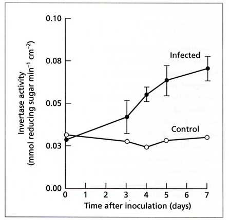
```
]
]

---

## 3.2. Effets des perturbations

### `r icon::fa("caret-right")` Effets sur le transfert des ressources :

.pull-left[
<br>
- .large[Alimentation en eau :]
 * .strong[obstruction] des vaisseaux (gommes, thyllose, pathogène)
 * perturbation de la .strong[transpiration]
 <br><br>

- .large[Translocation des photo-assimilats :]
 * .strong[hydrolyse] enzymatique (nécrotrophes)
 * .strong[détournement] des ressources carbonnées (biotrophes)
<br><br>

- .large[Perturbation de la croissance de la plante :]
 * nanisme, rabougrissement, déformations
 * flétrissement
 * ...
]

.pull-right[
.center[
```{r echo=F, out.width="58%"}
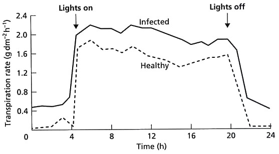
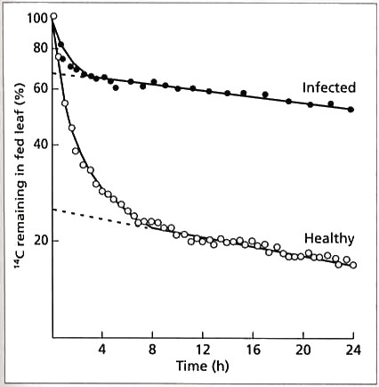
```
]
]

---
<br>
.center[
```{r echo=F, out.width="65%"}
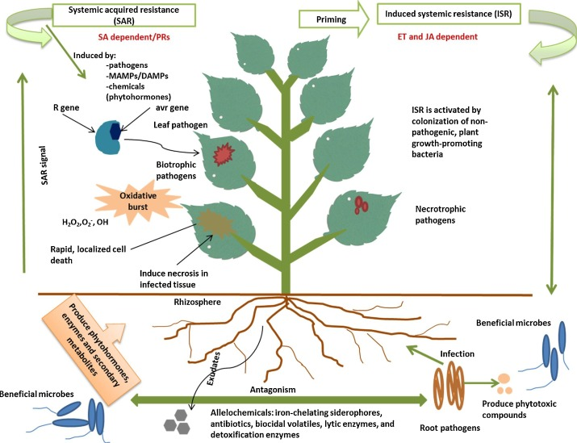
```
]

