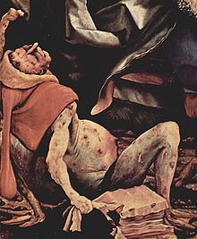
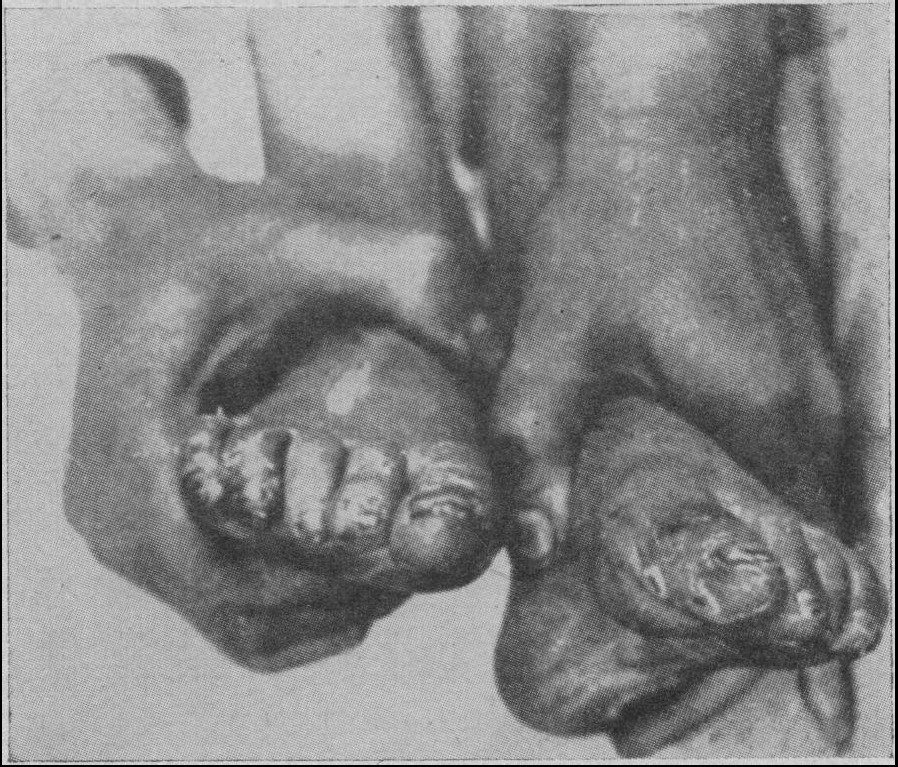
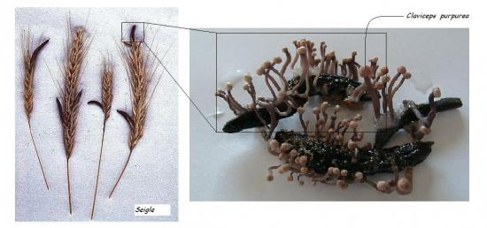
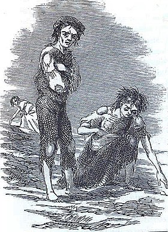
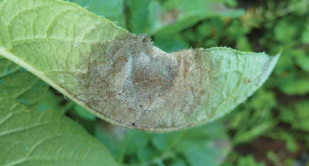
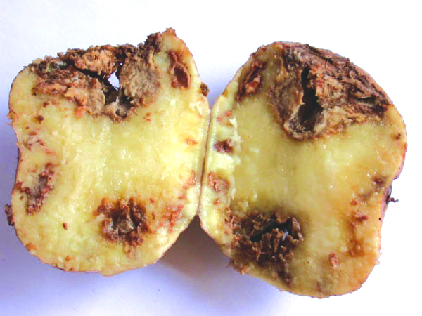

```{r setup, include=FALSE, message=FALSE}
options(htmltools.dir.version = FALSE)
library(knitrBootstrap)
library(anicon)
library(icon)
library(kableExtra)
library(DiagrammeR)
```

class: title-slide, animated, fadeIn

# Maladies cryptogamiques : méthodes de lutte
### Sébastien GUYADER
#### INRA - UR Astro - Petit-Bourg

---

layout: true
class: main-slide, animated, fadeIn
<div class="my-footer"><span>S. Guyader &nbsp; - &nbsp; Maladies cryptogamiques : méthodes de lutte</span></div> 

---
name: plan

.left-column[
# Plan
]

.right-column[
###1. Introduction sur les maladies cryptogamiques
  1.1. Repères historiques<br>
  1.2. Le "triangle de la maladie"<br>
  {{content}}
]
--
###2. Biologie et épidémiologie des champignons phytopathogènes
  2.1. Caractéristiques générales<br>
  2.2. Eléments d'épidémiologie<br>
{{content}}
--
###3. Méthodes de lutte
  3.1. Chimique<br>
  3.2. Génétique<br>
  3.3. Biologique<br>
  3.4. Prophylactique<br>
  3.5. Intégrée<br>
{{content}}
<br>
---

layout: false
class: section-slide, inverse, center, middle, animated, fadeIn
<div class="my-footer"><span style="color:white">S. Guyader &nbsp; - &nbsp; Maladies cryptogamiques : méthodes de lutte</span></div>

# 1. Introduction

---

layout: true
class: main-slide, animated, fadeIn
<div class="my-footer"><span>S. Guyader &nbsp; - &nbsp; Maladies cryptogamiques : méthodes de lutte</span></div>

---

## 1.1. Repères historiques

### L'ergot des céréales

.pull-left[
.large[
- Maladie de l'**ergotisme** : symptômes neurologiques (convulsions), physiques (gangrènes)
- Connue depuis **plus de 2000 ans**, mais épidémies importantes au Moyen Age
<br><br>
```{r echo=F, out.width="40%"}


```
]
]
--
.pull-right[
.large[
- Cause : l'ergot du seigle *Claviceps purpurea*
- ingestion de farine contaminée par des ergots (sclérotes) entraîne une **intoxication par alcaloïdes**
- la caractérisation de ces alcaloïdes a conduit à la découverte du **LSD**
<br><br>
```{r echo=F, out.width="100%"}

```
]
]

---

## 1.1. Repères historiques

### La grande famine en Irlande

.pull-left[
.large[
- Au XIX<sup>e</sup> siècle, **effondrement de la production** de pomme de terre (1845-1852)
- **1 million de morts** + 1 million d'émigrés vers les USA (chute de plus de 20% de la population)
<br><br>
```{r echo=F, out.width="45%"}

```
]]
--
.pull-right[
.large[
- Cause : le **mildiou de la pomme de terre** *Phytophtora infestans*
- La maladie entraîne une **nécrose** des feuilles et des tubercules
<br><br>
```{r echo=F, out.width="55%"}


```
]]

---

## 1.2. Le "triangle de la maladie"

### Maladie = interaction entre 3 éléments fondamentaux

.center[
```{r, echo=FALSE, out.width="100%"}
DiagrammeR::grViz("triangle.dot")

```
]

---

## 1.2. Le "triangle de la maladie"

### Maladie = interaction entre 3 éléments fondamentaux

.center[
```{r, echo=FALSE, out.width="100%"}
DiagrammeR::grViz("tetraedre.dot")

```
]

---

layout: false
class: section-slide, inverse, center, middle, animated, fadeIn
<div class="my-footer"><span style="color:white">S. Guyader &nbsp; - &nbsp; Maladies cryptogamiques : méthodes de lutte</span></div>

# 2. Biologie et épidémiologie des champignons phytopathogènes

---

layout: true
class: main-slide, animated, fadeIn
<div class="my-footer"><span>S. Guyader &nbsp; - &nbsp; Maladies cryptogamiques : méthodes de lutte</span></div>

---

## 2.1. Caractéristiques générales

<br>
.pull-left[
- .Large[Groupe très hétérogène]<br><br>
- .Large[Plus de 100 000 espèces recensées]<br><br>
- .Large[Responsables de 60% des maladies des plantes]<br><br>
- .Large[Organismes hétérotrophes (par absorption)]<br><br>
- .Large[Grand potentiel d'adaptation aux milieux]
]
.pull-right[
```{r echo=F, out.width="45%"}

```
]
---

## 2.1. Caractéristiques générales

### Classification<br>
.Large[La classification est complexe, et sujette à des évolutions]<br><br>